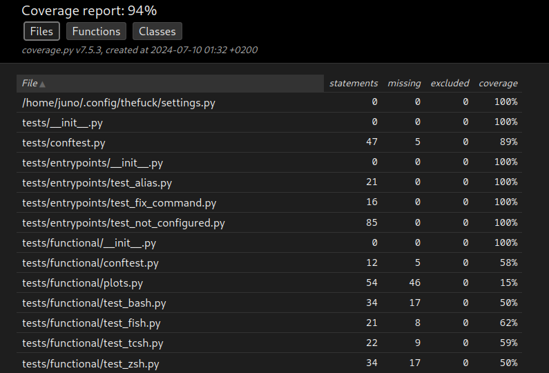

# Report for Assignment 1 resit

## Project chosen

Name: Thefuck

URL: https://github.com/nvbn/thefuck

Number of lines of code and the tool used to count it: 13077, counted with lizard.

Programming language: Pyt

## Coverage measurement with existing tool

For the initial coverage measurment I used coverage.py, a tool for coverage reports in Python. Since the suite for the project is pytest, in order to measure the code coverage I used the following commands:

```coverage run -m pytest```

And after that, in order to represent the code in a cleaner manner:

```coverage html```

Which generates a nice report for us to be able to read the information in a more visual way. This resulted in the following:



## Coverage improvement

### Individual tests

<The following is supposed to be repeated for each function (2 in total)>

<Function 1>

<Show a patch (diff) or a link to a commit made in your forked repository that shows the new/enhanced tests for function 1>

<Provide a screenshot of the old coverage results for such function>

<Provide a screenshot of the new coverage results for such function>

<State the coverage improvement with a number and elaborate on why the coverage is improved>

### Overall

<Provide a screenshot of the old coverage results by running an existing tool (the same as you already showed at the beginning of the report)>

<Provide a screenshot of the new coverage results by running the existing tool using all test modifications>
