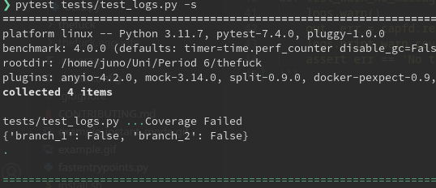
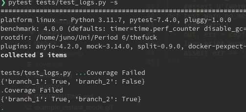
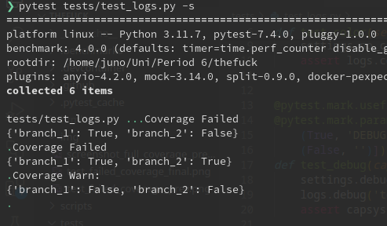
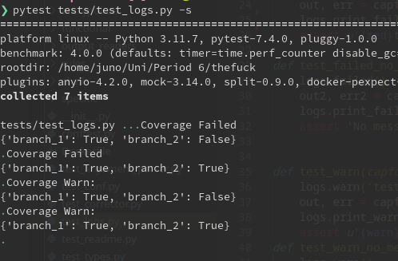
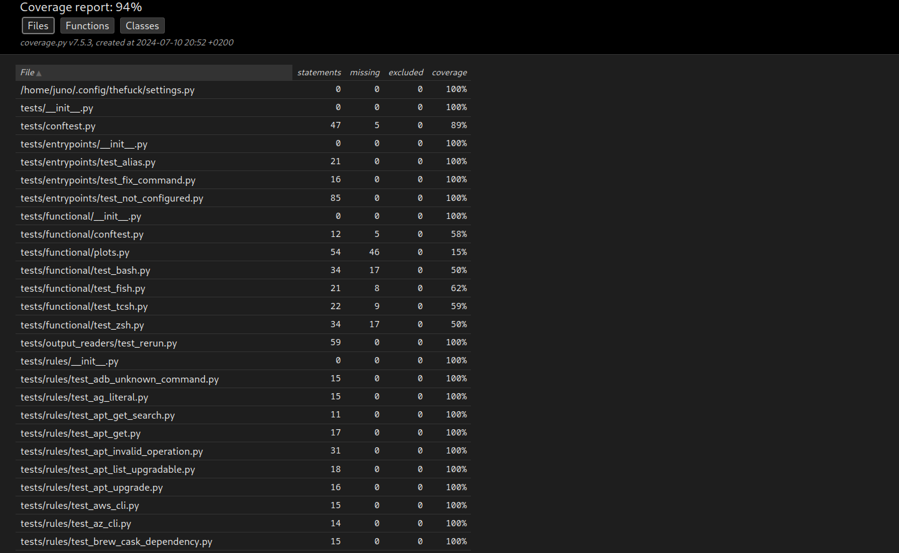

# Report for Assignment 1 resit

## Project chosen

Name: Thefuck

URL: https://github.com/nvbn/thefuck

Number of lines of code and the tool used to count it: 13077, counted with lizard.

Programming language: Pyt

## Coverage measurement with existing tool

For the initial coverage measurment I used coverage.py, a tool for coverage reports in Python. Since the suite for the project is pytest, in order to measure the code coverage I used the following commands:

```coverage run -m pytest```

And after that, in order to represent the code in a cleaner manner:

```coverage html```

Which generates a nice report for us to be able to read the information in a more visual way. This resulted in the following:


## Coverage improvement

### Individual tests

#### Failed function





There is an improvement of a hundred percent, since the function was not covered previously. With the print statements tested and the value passed to the function being the only two possible results, I made 2 test functions for the 2 possible outcomes.

#### Warn function





As the previous function, the improvement is a hundred percent, since the function was not covered previously. The inner workings of the two functions are similar, so It was the same logic, but with a different result.


### Overall



